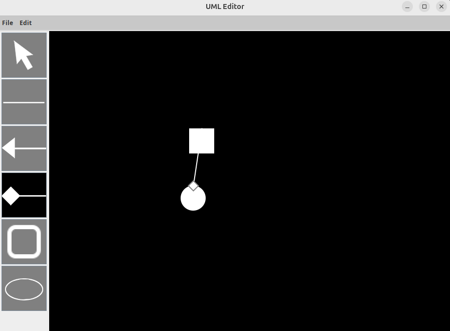

# UML-editor
> [題目要求](./requirement.pdf)

## Requirement 
* JAVA OpenJDK 17 
* 輸入指令 `java -version` 能出現
```
openjdk version "17.0.15" 2025-04-15
OpenJDK Runtime Environment (build 17.0.15+6-Ubuntu-0ubuntu124.04)
OpenJDK 64-Bit Server VM (build 17.0.15+6-Ubuntu-0ubuntu124.04, mixed mode, sharing)
```

## QUICK START 
> 以 vscode 執行為例 
* 必要安裝的 vscode extension
  * Gradle for Java
  * Maven for Java
  * Project Manager for Java
  * Language support for Java ™ for Visual Studio Code
* 從 `main.py` 處進行執行

## UML Editor 
> 這份 code 按照這個 UML 進行設計


## 畫面執行示意圖


## 參考連結
[尋找好看的 icon](https://icons8.com/icons/set/rectangle--white)